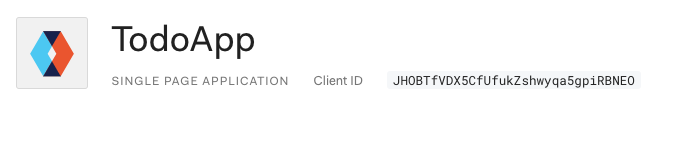
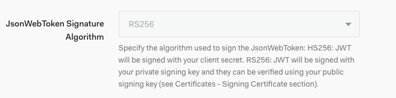
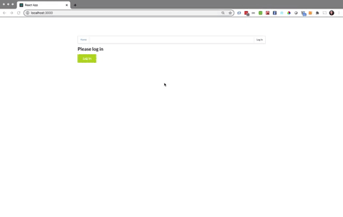
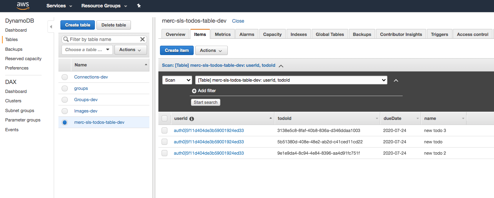
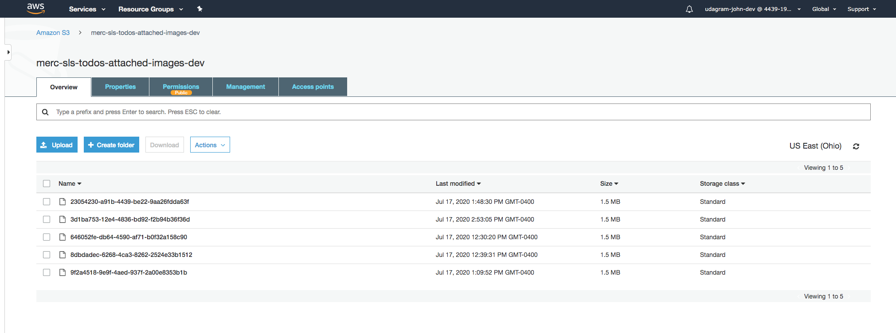
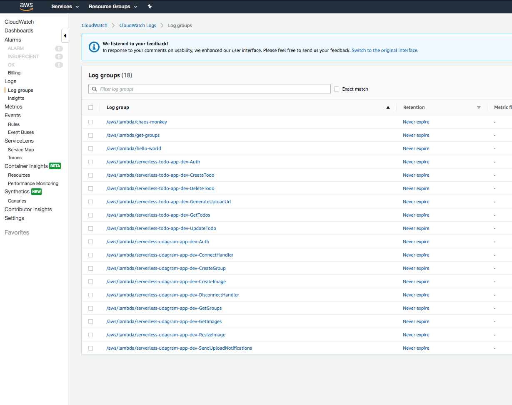

# Serverless TODO

A simple TODO application using AWS Lambda and Serverless framework that will allow creating/removing/updating/fetching TODO items. Each TODO item can optionally have an attachment image. Each user only has access to TODO items that he/she has created.

# Serverless Project Completion Algo

Step 1: Authentication (App and in code)



With default RS256:



Create and Configure: `Auth` - this function should implement a custom authorizer for API Gateway that should be added to all other functions.

  - First updated the server side with the JSON Web Key Set in the auth0Authorizer.ts
  - Now the implementation with JSON Web Key Set. There were two options from lessons. One is to use the rs256Auth0Authorizer and `cert` from Auth0 and the other is to use `AWS KMS`. I wasn't sure how to now utilize the `jwksUrl` to download the certificate until reading [this post](https://knowledge.udacity.com/questions/203918) which suggestion has the `Axios` package for getting and parsing the certificate from the url. Also found [this thread](https://knowledge.udacity.com/questions/214229) useful in understanding this authentication method.

  - Axios npm package: https://www.npmjs.com/package/axios

Step 3: (24 commits) to implement both the services and the configuration. The troubleshooting mostly involved the secondary indexing and query format for dynamodb (and the relationship between the two) and the return structure.
  - Create and Configure: `GenerateUploadUrl` - returns a pre-signed URL that can be used to upload an attachment file for a TODO item.
  - Create and Configure: `CreateTodo` - should create a new TODO for a current user. A shape of data send by a client application to this function can be found in the `CreateTodoRequest.ts` file
  - Create and Configure: `GetTodos` - should return all TODOs for a current user. A user id can be extracted from a JWT token that is sent by the frontend
  - Create and Configure: `UpdateTodo` - should update a TODO item created by a current user. A shape of data send by a client application to this function can be found in the `UpdateTodoRequest.ts` file
  - Create and Configure: `DeleteTodo` - should delete a TODO item created by a current user. Expects an id of a TODO item to remove.

# Submission

The following video and screenshots are for the project submission.

## Video


## DynamoDB


## s3


## CloudWatch


## Lambda


# How to run the application

## Backend

To deploy an application run the following commands (you'll need to change the prefixes in the serverless.yaml since that are globally unique)

```
cd backend
npm install
sls deploy -v
```

## Frontend

To run a client application first edit the `client/src/config.ts` file to set correct parameters. And then run the following commands:

```
cd client
npm install
npm run start
```
